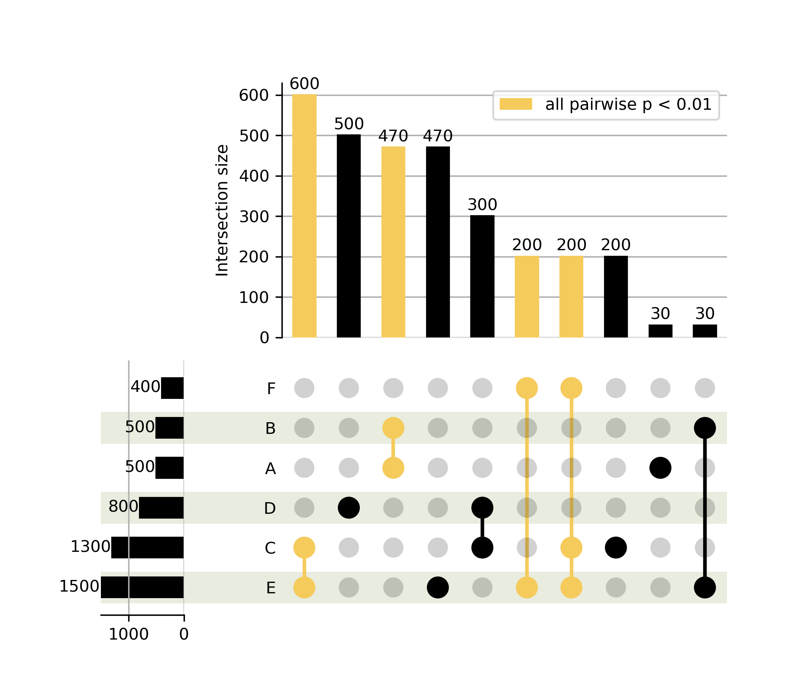

# upset_enrich
Python module to create UpSet plot with bars colored to show significant overlap between every pair of input sets within the group. Adds a little bit of functionality on top of [UpSetPlot](https://upsetplot.readthedocs.io/en/stable/).

## Installation
```
pip install upset_enrich
```

## Usage
You need to `from upset_enrich import upset_enrich` and get your data in the right format, then call the `upset_enrich()` function. Data should be a dict, with group names as keys, and values being lists or sets of group members. Values will be converted to strings.

<p align="center">
  
</p>

Here is an example (to generate the above plot):

```
from upset_enrich import upset_enrich

data = {}

# How many total set members were there to choose from?
tot_members = 3000

data['A'] = list(range(0,500))
data['B'] = list(range(30,530))
data['C'] = list(range(1200,2500))
data['D'] = list(range(2200,3000))
data['E'] = list(range(500,2000))
data['F'] = list(range(1000,1400))

upset_enrich(data, tot_members,
    plot_out='upset_example.pdf',
    p_thresh=0.01)
```

This will create a plot in the current directory called `upset_example.pdf`.

Other parameters you can adjust include:
```
max_subset = the maximum number of subsets (vertical bars) to include in the plot
shading_color = hex value for the background color of shaded rows
bg_color = the fill color of non-highlighted bars
enrich_color = the fill color of highlighted bars (where there is significant overlap)
```
